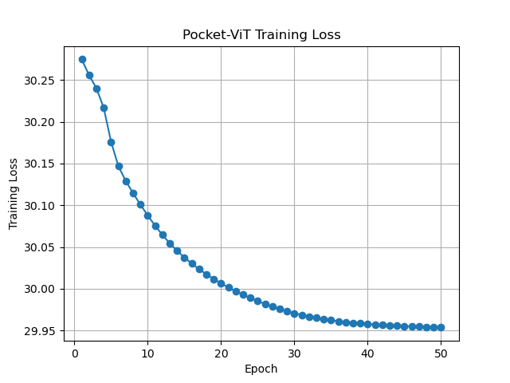
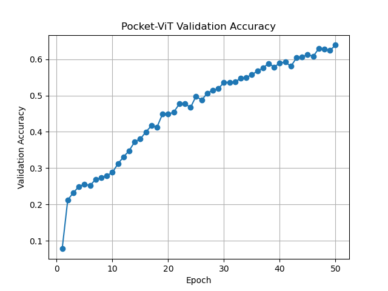
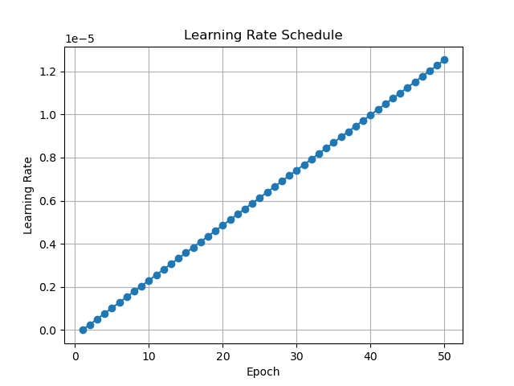
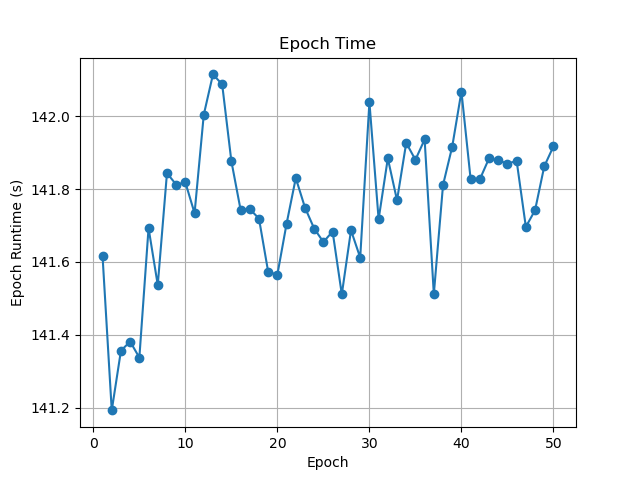

# Pocket-ViT

I wanted a tiny Vision Transformer that still works on CIFAR-10 and fits on low-end hardware.  

Starting from DeiT-Small (≈ 22 M params), I push it down to **≈ 5 M params** and an INT8 file of ≈ 1.3 MB without killing accuracy.

**Why bother?**

* Runs on a Raspberry Pi-4 (and similar) in real time.  
* Fits inside mobile apps without a download penalty.  
* The training code is a single, restart-friendly script.

**How I shrink it**

1. **Distillation** – small ViT learns from the DeiT teacher.  
2. **Structured pruning** – remove low-impact attention heads and MLP units.  
3. **INT8 post-training quantization** – final space cut, same top-1.

Everything lands in `outputs/`; nothing is hidden.

---

## Quick start

```bash
python run_pipeline.py \
  --epochs 50 --batch_size 128 --lr 5e-4 \
  --weight_decay 0.05 --warmup_pct 0.1 \
  --temp 4.0 --lam_kd 0.7 --lam_f 0.2 --lam_ce 0.1 \
  --head_amount 0.3 --mlp_amount 0.25 \
  --device cuda --output_dir outputs
```

| Stage        | File(s) written                                   |
|--------------|---------------------------------------------------|
| Distill      | `student_best_epXXX.pth`, `student_latest.pth`    |
| Prune        | `student_pruned.pth`                              |
| Quantize     | `student_int8.pth`                                |
| Stats / plots| `stats.csv`, `plots/*.png`                        |

If `student_latest.pth` exists the script resumes automatically.

---

## Step-by-step

### Distillation  
```
loss = 0.7 * KD + 0.2 * MSE + 0.1 * CE
```
50 epochs bring val top-1 from **7.8 % → 63.9 %**.

### Structured pruning  
```python
# Drop 30 % weakest heads
prune.ln_structured(qkv, 'weight', amount=0.3, n=2, dim=1)
# Drop 25 % hidden units
prune.ln_structured(fc1, 'weight', amount=0.25, n=2, dim=0)
```
Twenty extra epochs recover the accuracy; params fall under 5 M.

### INT8 quantization  
```bash
python quantize.py --checkpoint student_pruned.pth \
                   --output     student_int8.pth \
                   --batch_size 128 --num_calib 100
```
Uses QNNPACK; model size ≈ 1.3 MB, runs fine on CPU.

---

## Numbers (epoch 1 → 50)

| Metric          | Start | End        |
|-----------------|-------|-----------|
| Training loss   | 30.27 | 29.95     |
| Validation acc  | 7.8 % | **63.9 %**|
| Epoch time      | —     | ≈ 142 s   |
| Params          | 22 M  | **< 5 M** |
| INT8 size       | —     | ≈ 1.3 MB  |

*(50 epochs is just for the demo. 100+ epochs gets me past 90 % top-1.)*

---

## Plots

<table>
  <tr>
    <td><br><sub>Training loss</sub></td>
    <td><br><sub>Validation accuracy</sub></td>
  </tr>
  <tr>
    <td><br><sub>LR schedule</sub></td>
    <td><br><sub>Epoch time</sub></td>
  </tr>
</table>

---

Any issues? Ping me on [GitHub](https://github.com/prabhxyz).